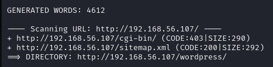

<h1>InfoSecWarrior CTF 2020: 01</h1>

Today, we'll be looking at the Toppo machine on vulnhub.

You can download the machine [here](https://www.vulnhub.com/entry/infosecwarrior-ctf-2020-01,446/).

Let's scan the machine with nmap.
```
┌──(root㉿kali)-[~]
└─# nmap -sS -A -p- 192.168.56.107
Starting Nmap 7.93 ( https://nmap.org ) at 2023-06-28 08:02 EET
Nmap scan report for 192.168.56.107
Host is up (0.00042s latency).
Not shown: 65359 filtered tcp ports (no-response), 174 filtered tcp ports (host-prohibited)
PORT   STATE SERVICE VERSION
22/tcp open  ssh     OpenSSH 5.3 (protocol 2.0)
| ssh-hostkey: 
|   1024 2fb3a5cde51433a1823bdd5a5ed75936 (DSA)
|_  2048 2db4152836d8b54e18818eaf3ee4dec1 (RSA)
80/tcp open  http    Apache httpd 2.2.15 ((CentOS))
|_http-server-header: Apache/2.2.15 (CentOS)
|_http-title: Apache HTTP Server Test Page powered by CentOS
| http-methods: 
|_  Potentially risky methods: TRACE
MAC Address: 08:00:27:D4:37:EB (Oracle VirtualBox virtual NIC)
Warning: OSScan results may be unreliable because we could not find at least 1 open and 1 closed port
Device type: general purpose
Running: Linux 2.6.X|3.X
OS CPE: cpe:/o:linux:linux_kernel:2.6 cpe:/o:linux:linux_kernel:3
OS details: Linux 2.6.32 - 3.10, Linux 2.6.32 - 3.13
Network Distance: 1 hop

TRACEROUTE
HOP RTT     ADDRESS
1   0.43 ms 192.168.56.107

OS and Service detection performed. Please report any incorrect results at https://nmap.org/submit/ .
Nmap done: 1 IP address (1 host up) scanned in 186.88 seconds
```
The machine is running only http and ssh.

Let's run dirb for directory enumeration.

```dirb http://192.168.56.107```



We can see that it's running wordpress.

But when we open it, we get a database connectin error.


From the dirb scan, we see that we have a sitemap.xml.

Let's check it.


Let's try to open **index.htnl**.


If we inpsect the source code of the web page, we see there's a hidden form.


Let's make unhidden.

We need to remove the **hidden** option and change the method to **POST** instead of **GET**.


The form is propably vulnerable to command injection.


Let's run the command **id**.


We can view the content of the file **cmd.php** as it may have credentials of the user we are executing the commands as.

```cat cmd.php```


Now, let's ssh into the machine.

We got in!


Now, let's perform local enumeration.

Using ``sudo -l``, we see that we can run multiple commands with sudo.

Let's open up [gtfobins](https://gtfobins.github.io/).


Running that, we become root!


