<h1>BLOGGER: 1</h1>

Today, we'll be looking at the Toppo machine on vulnhub.
You can download the machine [here](https://www.vulnhub.com/entry/blogger-1,675/).

<h2>Nmap</h2>
```
┌──(root㉿kali)-[~]
└─# nmap -sS -A 192.168.56.104 
Starting Nmap 7.93 ( https://nmap.org ) at 2023-06-21 14:55 EET
Nmap scan report for 192.168.56.104
Host is up (0.00029s latency).
Not shown: 998 closed tcp ports (reset)
PORT   STATE SERVICE VERSION
22/tcp open  ssh     OpenSSH 7.2p2 Ubuntu 4ubuntu2.10 (Ubuntu Linux; protocol 2.0)
| ssh-hostkey: 
|   2048 951d828f5ede9a00a80739bdacadd344 (RSA)
|   256 d7b452a2c8fab70ed1a8d070cd6b3690 (ECDSA)
|_  256 dff24f773344d593d77917455aa1368b (ED25519)
80/tcp open  http    Apache httpd 2.4.18 ((Ubuntu))
|_http-server-header: Apache/2.4.18 (Ubuntu)
|_http-title: Blogger | Home
MAC Address: 02:1C:00:A5:06:70 (Unknown)
Device type: general purpose
Running: Linux 3.X|4.X
OS CPE: cpe:/o:linux:linux_kernel:3 cpe:/o:linux:linux_kernel:4
OS details: Linux 3.2 - 4.9
Network Distance: 1 hop
Service Info: OS: Linux; CPE: cpe:/o:linux:linux_kernel

TRACEROUTE
HOP RTT     ADDRESS
1   0.29 ms 192.168.56.104

OS and Service detection performed. Please report any incorrect results at https://nmap.org/submit/ .
Nmap done: 1 IP address (1 host up) scanned in 14.00 seconds
```

Let's use dirsearch.

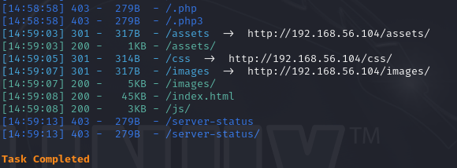

Exploring the assets directory, I found that the machine is running wordpress at **http://192.168.56.104/assets/fonts/blog/**.

You might need to add **blogger.thm** to your hosts file in order to access the blog.

``echo "192.168.56.104 blogger.thm" >> /etc/hosts``

Let's use wpscan.

``wpscan --url http://blogger.thm/assets/fonts/blog/ -e``

We found a username: **j@m3s**.

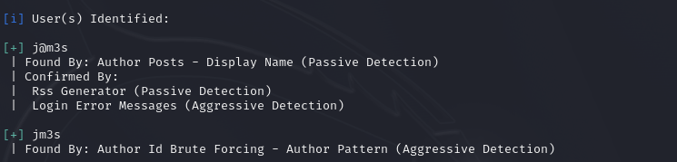

After some enumeration, I didn't find anything useful.

So I ran wpscan again but with plugins detection aggressive.

``wpscan --url http://blogger.thm/assets/fonts/blog/ --plugins-detection aggressive``

Great! we found an outdated plugin called **wpdiscuz**.

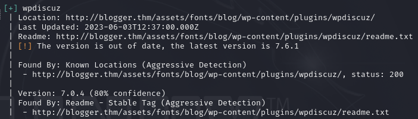

Using searchsploit we can see it has a file upload vulnerability.

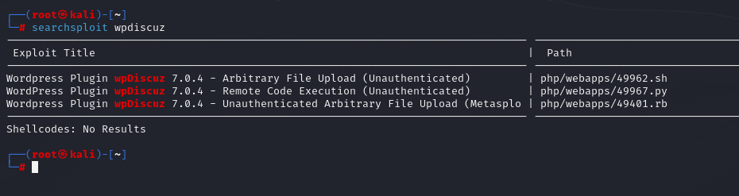

If you open any of the posts, you will find a comment section with file upload.

Let's upload a php reverse shell.

If you're using kali, you can find a shell at **/usr/share/webshells/php/php-reverse-shell.php**.

But notice that it only accepts images.

To bypass that, I'll the GIF header to the shell file.

GIF header: **GIF87a**

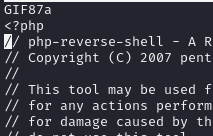

Fill out the fields and click on post comment.

You can see that we bypassed the filter and out shell file is uploaded.

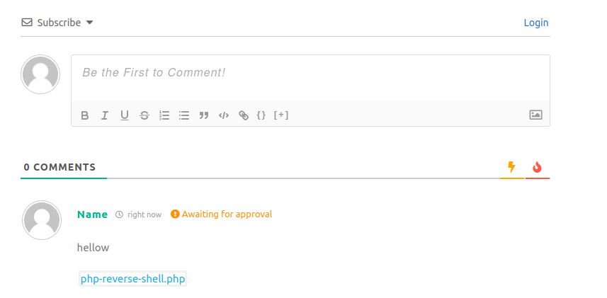

And we opened a shell on the system.

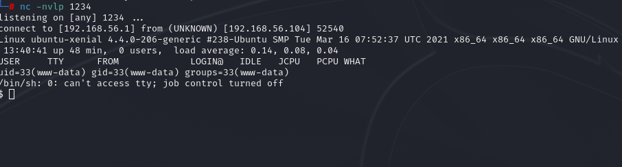

You can stabilize your shell with these two commands.

``python3 -c 'import pty;pty.spawn("/bin/bash")'``

``export TERM=xterm``

In the home dirctory for the user james, we found the user flag but we can't read it.

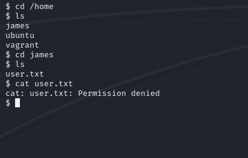

After some enumeration, I found an interesting file.

Let's extract it.

``gunzip -d backup.tar.gz``

``tar -xvf backup.tar``

We got the user flag **user.txt**.

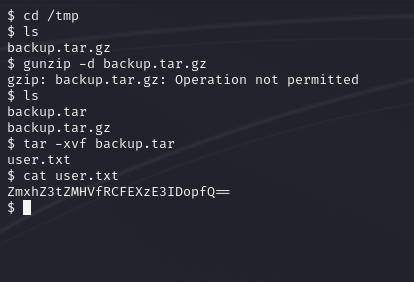

And looks like that is base64, let's decode it.

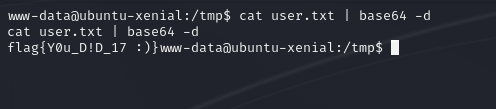

After some more local enumeration, I found a file called **backup.sh** in crontab.

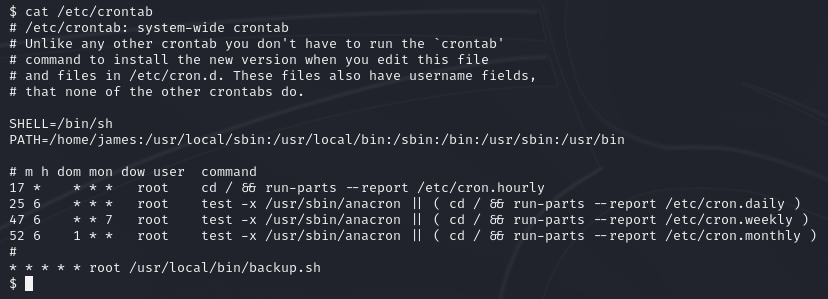

After some time, I found that the user **vagrant** uses the password **vagrant** which is the same as the username.

``su vagrang``

Using ``sudo -l``, we can see that the user **vagrant** can run any command with sudo.

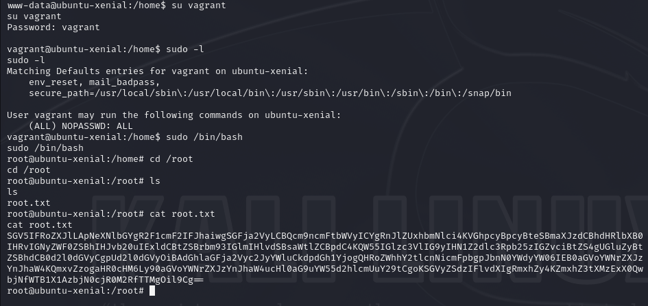

Decoding the root flag...

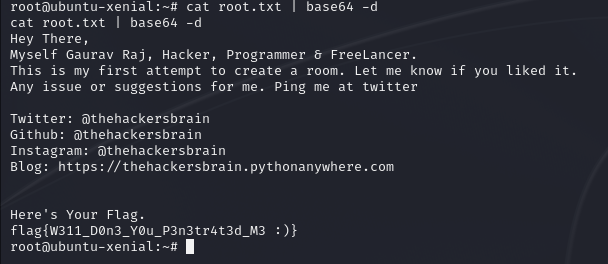
