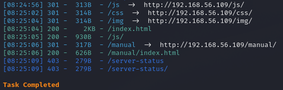
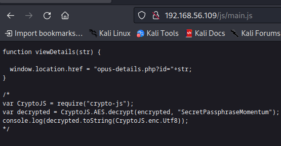
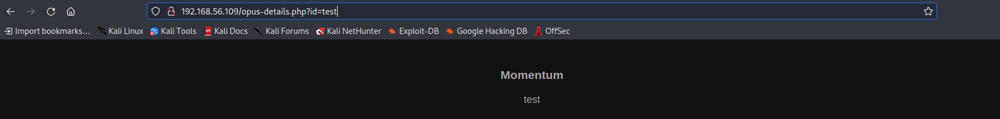
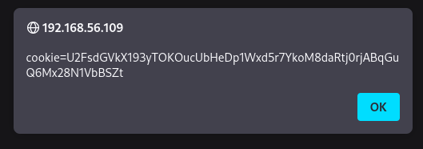
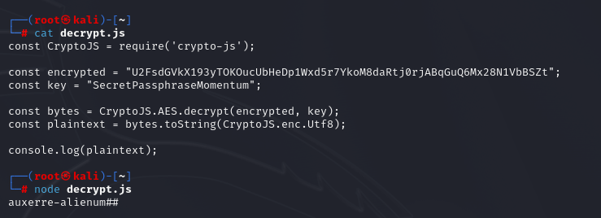
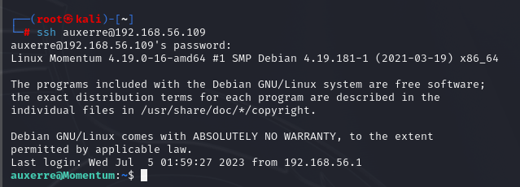
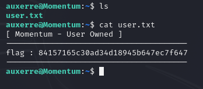
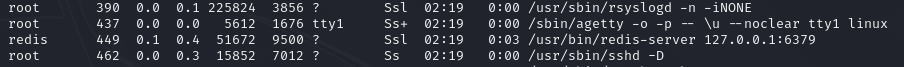
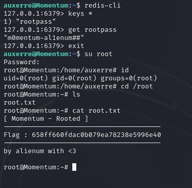

#Momentum: 1

Today, we'll taking a look at the first machine of the momentum series on vulnhub.

You can download the machine [here](https://www.vulnhub.com/entry/momentum-1,685/).

Let's scan the machine with nmap.
```
┌──(root㉿kali)-[~]
└─# nmap -sS -A -p- 192.168.56.109
Starting Nmap 7.93 ( https://nmap.org ) at 2023-07-08 08:21 EET
Nmap scan report for 192.168.56.109
Host is up (0.00015s latency).
Not shown: 65533 closed tcp ports (reset)
PORT   STATE SERVICE VERSION
22/tcp open  ssh     OpenSSH 7.9p1 Debian 10+deb10u2 (protocol 2.0)
| ssh-hostkey: 
|   2048 5c8e2cccc1b03e7c0e2234d860314e62 (RSA)
|   256 81fdc64c5a500a27ea833864b98bbdc1 (ECDSA)
|_  256 c18f87c1520927605f2e2de0080372c8 (ED25519)
80/tcp open  http    Apache httpd 2.4.38 ((Debian))
|_http-title: Momentum | Index 
|_http-server-header: Apache/2.4.38 (Debian)
MAC Address: 08:00:27:47:5D:5A (Oracle VirtualBox virtual NIC)
Device type: general purpose
Running: Linux 4.X|5.X
OS CPE: cpe:/o:linux:linux_kernel:4 cpe:/o:linux:linux_kernel:5
OS details: Linux 4.15 - 5.6
Network Distance: 1 hop
Service Info: OS: Linux; CPE: cpe:/o:linux:linux_kernel

TRACEROUTE
HOP RTT     ADDRESS
1   0.15 ms 192.168.56.109

OS and Service detection performed. Please report any incorrect results at https://nmap.org/submit/ .
Nmap done: 1 IP address (1 host up) scanned in 14.98 seconds
```
The machine is running an Apache server and ssh.

Let's discover directories.

```dirsearch -u 192.168.56.109```



In the **js** directory, there's a file **main.js** that has a php file and a password and looks like it's using CryptoJS.



Let's check that php file.

And looks like it just prints the text we put.



I tried a bunch of things, then I tried to view the cookie with js.

```http://192.168.56.109/opus-details.php?id=<script>alert(document.cookie)</script>```


We got the cookie.



And looks like it's encrypted.

We could use CryptoJS and the key we found earlier to decrypt it.

If you don't have CryptoJS, you can install it with the following command.

```npm install crypto-js```

You can read the documentation of CryptoJS [here](https://cryptojs.gitbook.io/docs/).

And you can also read this [article](https://javascript.plainenglish.io/how-to-start-with-crypto-js-with-example-b679eb04d7d3).

I then made this script to decrypt the cookie.



I then tried to ssh and got in with the user **auxerre** and the password **auxerre-alienum##**



I then found the user flag.



After some local enumeration, I used the command **ps aux** and found that the machine is running a redis server.



You can use this command to connect to the server.

``redis-cli``

I then found the root password, switched to root and got the root flag.

